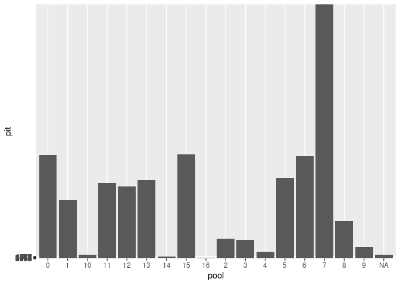

Salamanders by the Sea: Site Fidelity and Interpool Movement of Spotted
Salamanders Breeding in Rocky Cliff Pools
================
Georgia Lattig
03/01/24

``` r
pools <- read_csv("/cloud/project/data/tidy_data/pools.csv")
```

    ## Rows: 355 Columns: 12
    ## ── Column specification ────────────────────────────────────────────────────────
    ## Delimiter: ","
    ## chr  (1): date
    ## dbl (11): pool, salinity, salinity2, pool_temp, total, unmarked, red, orange...
    ## 
    ## ℹ Use `spec()` to retrieve the full column specification for this data.
    ## ℹ Specify the column types or set `show_col_types = FALSE` to quiet this message.

``` r
sals <- read_csv("/cloud/project/data/tidy_data/sals.csv")
```

    ## Rows: 1006 Columns: 11
    ## ── Column specification ────────────────────────────────────────────────────────
    ## Delimiter: ","
    ## chr (6): date, color, sex, year, notes, recap
    ## dbl (5): pool, pit, salinity, pool_temp, pit_year
    ## 
    ## ℹ Use `spec()` to retrieve the full column specification for this data.
    ## ℹ Specify the column types or set `show_col_types = FALSE` to quiet this message.

## Data Processing

``` r
(`2023pits` <- sals %>% 
  filter(year == 2023))
```

    ## # A tibble: 58 × 11
    ##    date     pool   pit color sex   year  salinity pool_temp notes recap pit_year
    ##    <chr>   <dbl> <dbl> <chr> <chr> <chr>    <dbl>     <dbl> <chr> <chr>    <dbl>
    ##  1 23-04-…     0  4745 green <NA>  2023     NA         NA   no c… no        2023
    ##  2 23-04-…     0  4854 green <NA>  2023     NA         NA   abov… no        2023
    ##  3 23-04-…     1  4764 green <NA>  2023      0.14      10.4 <NA>  no        2023
    ##  4 23-04-…     2  3284 green <NA>  2023      0.17      10.7 2 un… no        2023
    ##  5 23-04-…     7  4800 green <NA>  2023      0.23      10.4 <NA>  no        2023
    ##  6 23-04-…     7  4883 green <NA>  2023      0.23      10.4 <NA>  no        2023
    ##  7 23-04-…     7  3358 green <NA>  2023      0.23      10.4 <NA>  no        2023
    ##  8 23-04-…     7  4863 green <NA>  2023      0.23      10.4 <NA>  no        2023
    ##  9 23-04-…     7  3218 green <NA>  2023      0.23      10.4 <NA>  no        2023
    ## 10 23-04-…     7  4714 green <NA>  2023      0.23      10.4 <NA>  no        2023
    ## # ℹ 48 more rows

``` r
sals <- sals %>% 
  mutate(year = case_when(
    pit %in% `2023pits` ~ "2023",
    .default = year
  ))

(`2022pits` <- sals %>% 
    filter(color == "blue"))
```

    ## # A tibble: 249 × 11
    ##    date     pool   pit color sex   year  salinity pool_temp notes recap pit_year
    ##    <chr>   <dbl> <dbl> <chr> <chr> <chr>    <dbl>     <dbl> <chr> <chr>    <dbl>
    ##  1 2022-0…     7  3293 blue  m     2022      0          5   <NA>  no        2022
    ##  2 2022-0…     0  3247 blue  m     2022      0          5.5 <NA>  no        2022
    ##  3 2022-0…     7  3305 blue  m     2022      0.29       5.5 <NA>  no        2022
    ##  4 2022-0…     0  3337 blue  m     2022      0          5.5 <NA>  no        2022
    ##  5 2022-0…     5  3358 blue  m     2022      0.32       5.5 <NA>  no        2022
    ##  6 2022-0…     5  3382 blue  m     2022      0.32       5.5 <NA>  no        2022
    ##  7 2022-0…     5  3383 blue  m     2022      0.32       5.5 <NA>  no        2022
    ##  8 2022-0…     6  3337 blue  m     2022      0.19       4.3 <NA>  no        2022
    ##  9 2022-0…    13  3305 blue  m     2022      0.3        5.9 <NA>  no        2022
    ## 10 2022-0…     0  3325 blue  m     2022      0.19       5.2 <NA>  no        2022
    ## # ℹ 239 more rows

``` r
sals <- sals %>% 
  mutate(year = case_when(
    pit %in% `2022pits` ~ "2022",
    .default = year
  ))

sals <- sals %>% 
  mutate(color = case_when(
    year == "2017" ~ "yellow",
    year == "2018" ~ "pink",
    year == "2019" ~ "orange",
    year == "2020_2021" ~ "red",
    year == "2022" ~ "blue",
    year == "2023" ~ "green"
  ))
```

To date there have been 249 unique PIT tags deployed within the Otter
Point population of salamanders. Below I ran some code to see which PIT
tags, if any, had multiple years/colors associated with them. Out of 249
PIT tags, 46 are associated with more than one year (first year
observed/marked)/color.

``` r
sals %>% 
  group_by(year) %>% 
  count()
```

    ## # A tibble: 7 × 2
    ## # Groups:   year [7]
    ##   year          n
    ##   <chr>     <int>
    ## 1 2017         74
    ## 2 2018         26
    ## 3 2019        167
    ## 4 2020_2021   227
    ## 5 2022        327
    ## 6 2023         58
    ## 7 <NA>        127

``` r
sals %>% 
  group_by(pit) %>% 
  count(year)
```

    ## # A tibble: 309 × 3
    ## # Groups:   pit [250]
    ##      pit year          n
    ##    <dbl> <chr>     <int>
    ##  1  1299 2020_2021     1
    ##  2  3205 2019          1
    ##  3  3206 2019          3
    ##  4  3207 2019          3
    ##  5  3208 2019          2
    ##  6  3209 2022          1
    ##  7  3210 2022          1
    ##  8  3211 2019          3
    ##  9  3212 2022          2
    ## 10  3214 2022          2
    ## # ℹ 299 more rows

``` r
#This code revealed that there is an erroneous pit tag 1299 (I think this is actually the IMG file number). Keep this in mind as I'll have to omit the observation? from my visualizations/analysis.

sals %>% 
  count(pit)
```

    ## # A tibble: 250 × 2
    ##      pit     n
    ##    <dbl> <int>
    ##  1  1299     1
    ##  2  3205     1
    ##  3  3206     3
    ##  4  3207     3
    ##  5  3208     2
    ##  6  3209     1
    ##  7  3210     1
    ##  8  3211     3
    ##  9  3212     2
    ## 10  3214     2
    ## # ℹ 240 more rows

Though this is a major pain, I am going to look through the data for
each of these 46 PIT tags to determine which color/year should be
associated with them. Then I will create a massive case_when function to
recode the PIT tags as necessary. I will recode based on information
about year of first PIT tag (these are concrete data) or based on the
most frequent color tag recorded across seasons. In cases with equal
numbers of observations of different color tags, I looked for additional
information in the notes column or else trusted the first observation
because of increased sampling effort in 2022.

``` r
sals <- sals %>% 
  mutate(year = case_when(
    pit == "3216" ~ "2020_2021", #once recorded as pink in 2023 but all other times, across 2 seasons, red
    pit == "3218" ~ "2022", #recorded as new in 2023 but was first tagged with PIT in 2022; was NOT double-tagged
    pit == "3229" ~ "2020_2021", #once recorded as pink in 2023 but all other times, across 2 seasons, red
    pit == "3234" ~ "2022", #first tagged with PIT in 2022
    pit == "3237" ~ "2017", #yellow tag likely missed in first/only encounter in 2022, all other observations are yellow
    pit == "3244" ~ "2018", #recorded red in 2022 but accompanying notes read "kind of pink VIE" + recorded pink in 2023
    pit == "3248" ~ "2020_2021", #once recorded as pink in 2023 but all other times, across 2 seasons, red
    pit == "3262" ~ "2018", #once recorded as orange in 2023 but all other times, across nights, pink
    pit == "3273" ~ "2020_2021", #no color recorded in 2022 but multiple nights in 2023 recorded red
    pit == "3275" ~ "2022", #no color recorded when first PIT tagged 2022 nor all other times except one "yellow" in 2023 ***
    pit == "3284" ~ "2022", #first tagged with PIT in 2022
    pit == "3289" ~ "2018", #recorded pink 4 nights in 2022 and red 3 nights in 2023...
    pit == "3304" ~ "2019", #recorded 2x orange in 2022 including accompanying notes about the orange tag, 2023 "might not be pink, hard to tell"
    pit == "3316" ~ "2020_2021", #1x red in 2022, 1x orange in 2023; trusted 2022 observation due to larger field crew and "effort"
    pit == "3321" ~ "2022", #no color recorded when first PIT tagged 2022 nor other times except one "yellow" in 2023 ***
    pit == "3322" ~ "2020_2021", #once recorded as orange in 2023 but all other times, across nights, red
    pit == "3328" ~ "2020_2021", #once no color recorded in 2023 but all other times, across nights, red
    pit == "3339" ~ "2017", #once recorded red in 2023 but all other times, across nights, yellow
    pit == "3343" ~ "2022", #first tagged with PIT in 2022
    pit == "3345" ~ "2022", #first tagged with PIT in 2022, all observations no color except one orange record in 2023
    pit == "3358" ~ "2022", #first tagged with PIT in 2022
    pit == "3359" ~ "2020_2021", #once recorded orange in 2023 but all other times, across nights, red
    pit == "3360" ~ "2018", #no color recorded but notes say pink
    pit == "3361" ~ "2022", #no color recorded when first PIT tagged in 2022 nor other 2022 observations but twice recorded as orange in 2023 ***
    pit == "3363" ~ "2020_2021", #once no color recorded in 2023 but all other times, across seasons, red
    pit == "3370" ~ "2019", #recorded orange 4x in 2022, once pink and twice red in 2023
    pit == "3374" ~ "2017", #yellow tag likely missed in first/only encounter in 2022, all other observations are yellow
    pit == "3375" ~ "2017", #recorded yellow across 3 nights in 2023, no colors recorded in all prior observations ***
    pit == "3377" ~ "2022", #UV light forgotten so no color tag but first tagged with PIT 2022
    pit == "3380" ~ "2022", #first tagged with PIT in 2022
    pit == "3382" ~ "2022", #first tagged with PIT in 2022
    pit == "3383" ~ "2022", #first tagged with PIT in 2022
    pit == "3393" ~ "2022", #first tagged with PIT in 2022
    pit == "3396" ~ "2020_2021", #once recorded pink in 2023 but all other times, across seasons, red
    pit == "3399" ~ "2022", #no color recorded when first PIT tagged in 2022 nor all other 2022 observations except 2x recorded as red in 2023 with accompanying notes "may not be red"
    pit == "3401" ~ "2020_2021", #no color recorded when first PIT tagged in 2022 and only once recorded "red" but additional notes from another night say "has color tag but couldn't read it" ***
    pit == "3402" ~ "2019", #once recorded pink in 2023 but all other times, across nights, orange
    pit == "3403" ~ "2020_2021", #once recorded pink in 2023 but all other times, across seasons, red
    pit == "4741" ~ "2018", #always recorded pink
    pit == "4752" ~ "2019", #most often recorded orange
    pit == "4766" ~ "2023", #first tagged with PIT in 2023
    pit == "4797" ~ "2020_2021", #possible that the red color tag was missed when first PIT tagged 2023
    pit == "4832" ~ "2020_2021", #possible that the red color tag was missed when first PIT tagged 2023, all other times red
    pit == "4838" ~ "2023", #first tagged with PIT in 2023
    pit == "4842" ~ "2023", #first tagged with PIT in 2023
    pit == "4854" ~ "2023", #first tagged with PIT in 2023
    pit == "4880" ~ "2023", #first tagged with PIT in 2023
    pit == "4883" ~ "2023", #first tagged with PIT in 2023
    pit == "4888" ~ "2023", #first tagged with PIT in 2023
    pit == "4898" ~ "2020_2021", #possible that the red color tag was missed when first PIT tagged 2023, all other times red
    .default = year
  ))

sals <- sals %>% 
  mutate(color = case_when(
    year == "2017" ~ "yellow",
    year == "2018" ~ "pink",
    year == "2019" ~ "orange",
    year == "2020_2021" ~ "red",
    year == "2022" ~ "blue",
    year == "2023" ~ "green"
  ))
```

``` r
sals %>% 
  group_by(pit) %>% 
  count(year)
```

    ## # A tibble: 254 × 3
    ## # Groups:   pit [250]
    ##      pit year          n
    ##    <dbl> <chr>     <int>
    ##  1  1299 2020_2021     1
    ##  2  3205 2019          1
    ##  3  3206 2019          3
    ##  4  3207 2019          3
    ##  5  3208 2019          2
    ##  6  3209 2022          1
    ##  7  3210 2022          1
    ##  8  3211 2019          3
    ##  9  3212 2022          2
    ## 10  3214 2022          2
    ## # ℹ 244 more rows

``` r
#Below I removed the erroneous observation of PIT #1299 from the dataset (a single observation on 03/31/22)
sals <- sals %>% 
  filter(pit != "1299" |
        is.na(pit)) %>% 
  mutate(pit = as.character(pit)) %>% 
  mutate(pool = as.character(pool))
```

``` r
sals %>% 
  group_by(year) %>% 
  count()
```

    ## # A tibble: 7 × 2
    ## # Groups:   year [7]
    ##   year          n
    ##   <chr>     <int>
    ## 1 2017         80
    ## 2 2018         25
    ## 3 2019        168
    ## 4 2020_2021   236
    ## 5 2022        351
    ## 6 2023         53
    ## 7 <NA>         92

``` r
sals %>% 
  group_by(pit) %>% 
  count()
```

    ## # A tibble: 249 × 2
    ## # Groups:   pit [249]
    ##    pit       n
    ##    <chr> <int>
    ##  1 3205      1
    ##  2 3206      3
    ##  3 3207      3
    ##  4 3208      2
    ##  5 3209      1
    ##  6 3210      1
    ##  7 3211      3
    ##  8 3212      2
    ##  9 3214      2
    ## 10 3215      1
    ## # ℹ 239 more rows

``` r
sals %>% 
  group_by(pit) %>% 
  ggplot(aes(pool, pit), fill = year) +
  geom_col()
```

<!-- -->
